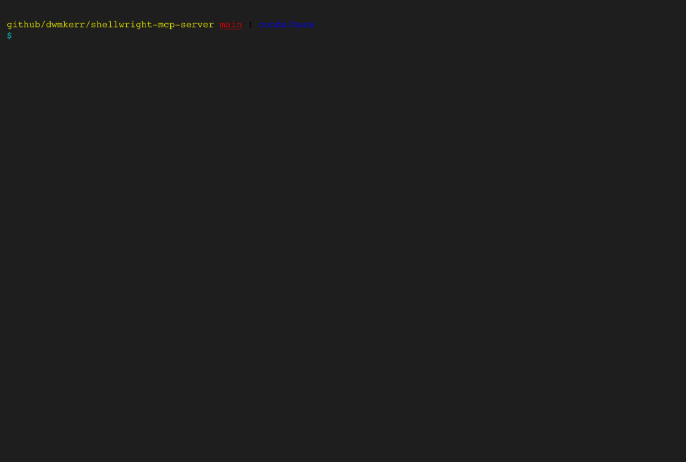

<p align="center">
  <h2 align="center"><code>🖥️ shellwright</code></h2>
  <h3 align="center">Playwright for the shell. AI-driven terminal automation, screenshots and video recording.</h3>
  <h5 align="center">Finally, your AI agents can <a href="TODO" target="_blank">close Vim</a>.</h5>
  <p align="center">
    
  </p>
  <p align="center">
    <a href="#quickstart">Quickstart</a> |
    <a href="#examples">Examples</a> |
    <a href="#tools">Tools</a> |
    <a href="#configuration">Configuration</a>
  </p>
  <p align="center">
    <a href="https://github.com/dwmkerr/shellwright-mcp-server/actions/workflows/cicd.yaml"></a>
    <a href="https://www.npmjs.com/package/shellwright-mcp-server"></a>
  </p>
</p>

## Quickstart

Run the MCP server:

```bash
npm install
npm run dev
```

The server runs at `http://localhost:7498/mcp`.

**Testing with the MCP Inspector**

Open the [MCP Inspector](https://github.com/modelcontextprotocol/inspector) in another terminal and connect to `http://localhost:7498/mcp` to list and test tools:

```bash
# Open MCP inspector in another terminal.
npx @modelcontextprotocol/inspector

# Now connect to:
# http://localhost:7498/mcp
```

**Testing with an Agent**

Run the [`demo.py`](./demo/demo.py) program to chat to an agent that has the Shellwright tool:

```bash
# Optionally setup your .env
# cp ./demo/.env.sample .env && vi .env

# Install requirements and run the agent.
pip install -r ./demo/requirements.txt
python ./demo/demo.py

# Output:
# User (enter message): Show me what the htop tool looks like showing me my resources.
```

You will see logs from the MCP server and the demo agent:


Screenshots and videos by default will be written to `./output`.

## Examples

Finally, your agents can be smart enough to [close `vim`](https://stackoverflow.com/questions/11828270/how-do-i-exit-vim):

> Open Vim. Write a message saying how to close Vim. Close Vim. Give me a screenshot of each step and a GIF recording.


## Tools

| Tool | Description |
|------|-------------|
| `shell_start` | Start a new PTY session |
| `shell_send` | Send input to a session |
| `shell_read` | Read the terminal buffer |
| `shell_snapshot` | Get terminal screen as text grid |
| `shell_screenshot` | Save terminal state to txt, svg, png |
| `shell_record_start` | Start recording for GIF export |
| `shell_record_stop` | Stop recording and export GIF |
| `shell_stop` | Stop a PTY session |

## Configuration

| Variable | Default | Description |
|----------|---------|-------------|
| `PORT` | `7498` | Server port ("SWRT" on a phone keypad) |
| `SHELLWRIGHT_TEMP_DIR` | `/tmp/shellwright` | Directory for recording frames |

## TODO

- Video export (MP4/MOV) via ffmpeg
- Set screen size tool
- Themes support
- Better logging

## License

MIT
