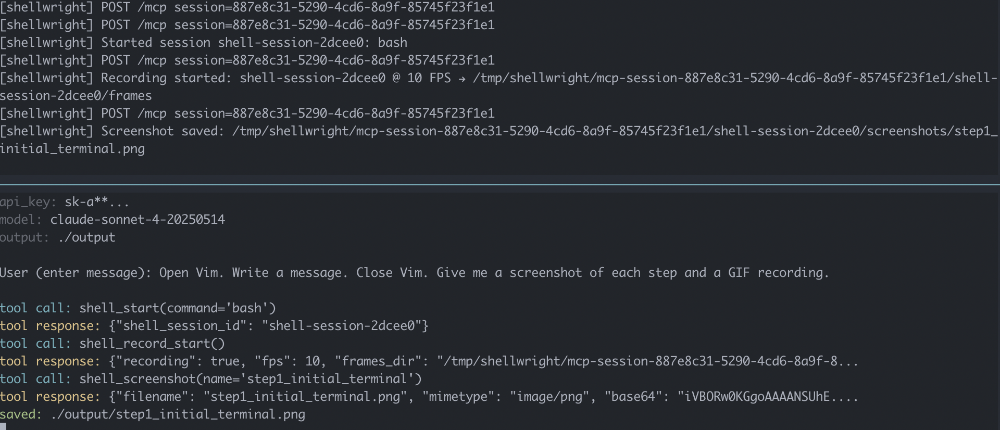

<p align="center">
  <h2 align="center"><code>🖥️ shellwright</code></h2>
  <h3 align="center">Playwright for the shell. AI-driven terminal automation, screenshots and video recording.</h3>
  <h4 align="center">Finally. Your AI agents can <a href="https://stackoverflow.com/questions/11828270/how-do-i-exit-vim" target="_blank">close Vim</a></h4>
  <p align="center"><em>
    User: Open Vim. Tell me how to close it. Close it. Record this as a video.
  </em></p>
  <p align="center">
    
  </p>
  <p align="center">
    <a href="#quickstart">Quickstart</a> |
    <a href="#examples">Examples</a> |
    <a href="#installation">Installation</a> |
    <a href="#configuration">Configuration</a> |
    <a href="#mcp-tools">MCP Tools</a> |
    <a href="#developer-guide">Developer Guide</a>
  </p>
  <p align="center">
    <a href="https://github.com/dwmkerr/shellwright/actions/workflows/cicd.yaml"></a>
    <a href="https://www.npmjs.com/package/@dwmkerr/shellwright"></a>
  </p>
</p>

## Quickstart

Configure your LLM, IDE or whatever to use the Shellwright MCP server:

```json
{
  "mcpServers": {
    "shellwright": {
      "command": "npx",
      "args": ["-y", "@dwmkerr/shellwright"]
    }
  }
}
```

Use a prompt such as "Using shellwright, open Vim. Write a message saying how to close Vim. Close Vim. Give me a screenshot of each step and a GIF recording, save the screenshots and videos to './output'". Or check the [Examples](#examples).

Check the [Installation](#installation) guide for how to setup Claude Code and other clients.

**Running Locally**

Run the MCP server in HTTP mode for local development:

```bash
npm install
npm run dev:http

# Or add parameters if needed...
npm run dev:http -- --font-size 32
```

The server runs at `http://localhost:7498/mcp`.

**Testing with the MCP Inspector**

Open the [MCP Inspector](https://github.com/modelcontextprotocol/inspector) in another terminal and connect to `http://localhost:7498/mcp` to list and test tools:

```bash
# Open MCP inspector in another terminal.
npx @modelcontextprotocol/inspector

# Now connect to:
# http://localhost:7498/mcp
```

**Testing with an Agent**

Run the [`demo.py`](./demo/demo.py) program to chat to an agent that has the Shellwright tool:

```bash
# Optionally setup your .env to specify configuration.
# cp ./demo/.env.sample .env && vi .env

# Install requirements and run the agent.
pip install -r ./demo/requirements.txt
python ./demo/demo.py

# Output:
# User (enter message): Show me what the htop tool looks like showing me my resources.

# ...or provide a message directly.
python ./demo/demo.py -- "Run a shell command to show me the names \
of the folders in this directory and take a screenshot and give me its path"
```

You will see logs from the MCP server and the demo agent:



Screenshots and videos by default will be written to `./output`.

## Examples

Have fun with some prompts.

Do some Vim stuff:

> Open Vim. Write a message saying how to close Vim. Close Vim. Give me a screenshot of each step and a GIF recording.


Open [`k9s`](https://k9scli.io/) and show [Ark](https://github.com/mckinsey/agents-at-scale-ark) agents:

> Open K9S. Check for resources of type 'agents'. Give me a GIF recording and take screenshots along the way.


Use [`htop`](https://github.com/htop-dev/htop):

> Open htop and show the most resource intensive process.


> Open vim, create validate.py that checks if arguments are UK postcodes. Print ✓ or ✗ for each. Then run: python3 validate.py on a set of UK postcodes (valid and invalid) such as "SW1A 1AA" "INVALID" "M1 1AA". Record as a video. Take 2-3 screenshots along the way.


## Installation

**Claude Code**

```bash
# Install for current project. Use '--scope user' for for user-wide.
claude mcp add --scope project shellwright -- npx -y @dwmkerr/shellwright

# Configure via command line parameters (or env vars) if needed.
claude mcp add --scope project shellwright -- npx -y @dwmkerr/shellwright \
  --log-path /tmp/shellwright/log.jsonl

# Uninstall. Same comment on 'scope'.
claude mcp remove --scope project shellwright
```

**Cursor / VS Code / Other MCP Clients**

Add to your MCP configuration file:

```json
{
  "mcpServers": {
    "shellwright": {
      "command": "npx",
      "args": ["-y", "@dwmkerr/shellwright"]
    }
  }
}
```

## Configuration

| Variable | Parameter | Default | Description |
|----------|-----------|---------|-------------|
| `PORT` | `--port`, `-p` | `7498` | Server port ("SWRT" on a phone keypad) |
| `THEME` | `--theme`, `-t` | `one-dark` | Color theme (`one-dark`, `one-light`, `dracula`, `solarized-dark`, `nord`, [etc...](./docs/themes.md) |
| `TEMP_DIR` | `--temp-dir` | `/tmp/shellwright` | Directory for recording frames |
| `FONT_SIZE` | `--font-size` | `14` | Font size in pixels for screenshots/recordings |
| `FONT_FAMILY` | `--font-family` | `Hack, Monaco, Courier, monospace` | Font family for screenshots/recordings (use a font with bold variant for bold text support) |
| - | `--cols` | `120` | Default terminal columns |
| - | `--rows` | `40` | Default terminal rows |
| - | `--http` | `false` | Use HTTP transport instead of stdio |
| - | `--log-path` | - | Log tool calls to JSONL file (one JSON object per line) |

Some configuration can also be provided by the LLM, simply prompt for it:

- Terminal Dimensions: e.g: "Use a terminal that is 80x24 for the recording"
- Theme: e.g: "Use the dracula theme for this recording"

## MCP Tools

| Tool | Description |
|------|-------------|
| [`shell_start`](#shell_start) | Start a new PTY session |
| [`shell_send`](#shell_send) | Send input to a session |
| [`shell_read`](#shell_read) | Read the terminal buffer |
| [`shell_screenshot`](#shell_screenshot) | Capture terminal as PNG |
| [`shell_record_start`](#shell_record_start) | Start recording for GIF export |
| [`shell_record_stop`](#shell_record_stop) | Stop recording and save GIF |
| [`shell_stop`](#shell_stop) | Stop a PTY session |

### **shell_start**

Start a new PTY session with a command. Columns, rows, and theme are optional and the defaults can be set in the [Configuration](#Configuration):

Start a shell session running `bash`:

```json
{
  "command": "bash",
  "cols": 80,
  "rows": 24
}
```

Start a session with an login mode shell and a specific theme:

```json
{
  "command": "bash",
  "args": ["--login", "-i"],
  "theme": "dracula"
}
```

Available themes (see [Theme Guide](./docs/themes.md) for previews):

| Theme | Type | Description |
|-------|------|-------------|
| `one-dark` | Dark | Muted, balanced colors (default) |
| `one-light` | Light | Clean, readable colors |
| [`dracula`](https://draculatheme.com) | Dark | Vibrant purple theme |
| [`solarized-dark`](https://ethanschoonover.com/solarized) | Dark | Blue-green, easy on eyes |
| [`nord`](https://nordtheme.com) | Dark | Arctic-inspired, cool blue tones |


The response contains the shell session ID (as multiple shell sessions can be run) and theme:

```json
{
  "shell_session_id": "shell-session-a1b2c3",
  "theme": "dracula"
}
```

### **shell_send**

Send input to a PTY session. Returns the full terminal buffer (plain text, no ANSI codes) before and after sending input, so the LLM can see exactly what changed on screen:

```json
{
  "session_id": "shell-session-a1b2c3",
  "input": "ls -la\n",
  "delay_ms": 100
}
```

The `delay_ms` parameter controls how long to wait after sending input before capturing `bufferAfter` (default: 100ms). Increase for slow commands.

The response includes the terminal buffer before and after the input was sent:

```json
{
  "success": true,
  "bufferBefore": "$ _",
  "bufferAfter": "$ ls -la\ntotal 24\ndrwxr-xr-x  5 user staff ...\n$ _"
}
```

### **shell_read**

Read the current terminal buffer. Use `raw: true` to include ANSI escape codes:

```json
{
  "session_id": "shell-session-a1b2c3",
  "raw": false
}
```

The response is the terminal content as plain text (truncated to 8KB to avoid context overflow):

```
total 24
drwxr-xr-x  5 user staff  160 Dec 18 10:00 .
drwxr-xr-x 10 user staff  320 Dec 18 09:00 ..
-rw-r--r--  1 user staff 1234 Dec 18 10:00 README.md
```

### **shell_screenshot**

Capture terminal as PNG. Also saves SVG, ANSI, and plain text versions:

```json
{
  "session_id": "shell-session-a1b2c3",
  "name": "my-screenshot"
}
```

The response contains a `download_url` for curl to save the file locally:

```json
{
  "filename": "my-screenshot.png",
  "download_url": "http://localhost:7498/files/mcp-.../screenshots/my-screenshot.png",
  "hint": "Use curl -o <filename> <download_url> to save the file"
}
```

### **shell_record_start**

Start recording frames for GIF export. Frames are captured at the specified FPS (default 10, max 30):

```json
{
  "session_id": "shell-session-a1b2c3",
  "fps": 10
}
```

The response confirms recording has started:

```json
{
  "recording": true,
  "fps": 10,
  "frames_dir": "/tmp/shellwright/.../frames"
}
```

### **shell_record_stop**

Stop recording and render frames to GIF:

```json
{
  "session_id": "shell-session-a1b2c3",
  "name": "my-recording"
}
```

The response contains a `download_url` for curl to save the file locally:

```json
{
  "filename": "my-recording.gif",
  "download_url": "http://localhost:7498/files/mcp-.../recordings/my-recording.gif",
  "hint": "Use curl -o <filename> <download_url> to save the file",
  "frame_count": 42,
  "duration_ms": 4200
}
```

### **shell_stop**

Stop a PTY session and clean up resources:

```json
{
  "session_id": "shell-session-a1b2c3"
}
```

The response confirms the session was stopped:

```json
{
  "success": true
}
```

[MCP Prompts](https://modelcontextprotocol.io/docs/concepts/prompts) are also available for common workflows like vim editing and recording sessions. See [`src/prompts.ts`](./src/prompts.ts).

## Troubleshooting

The MCP server by default will write screenshots, video frames and the GIF (if requested) to a temporary location. This location includes the MCP session ID and the Shell session ID (one MCP session can have many shell sessions):

```bash
# Show the contents of an MCP and shell session.
tree /tmp/shellwright/mcp-session-16281bdf-7881-458a-8bee-475b02d000d2/shell-session-c66b8a

# Output:
# .
# ├── frames                         # Frames for the GIF recording. These are 
# │   └── frame000000.png            # cleaned up at the end of the session.
# ├── recordings
# │   └── vim_tutorial_complete.gif  # The GIF recording (if requested).
# └── screenshots
# ├── step1_initial_terminal.ansi    # Individual screenshot w/ ansi color etc.
# ├── step1_initial_terminal.png     # Screenshot as PNG (ANSI->SVG->PNG).
# └── step1_initial_terminal.svg     # The SVG intermediate.
# └── step1_initial_terminal.txt     # Screenshot as plain text.
```

You can check raw `txt` files to troubleshoot the contents of screenshots. You can see the `ansi` content which contains formatting and color codes. Finally, you can open the `png` files - these are generated by converting the `ansi` to SVG (using themes defined in code) and then SVG is converted PNG. Check the plain text contents of a buffer, or raw ansi, or formatted like so:

```bash
# Show plain text. Make sure you are in the shell session temp directory.
cat ./k9s_initial_view.txt

# Show formatted ANSI. Good for troubleshooting color codes.
cat ./k9s_initial_view.ansi
```

## Developer Guide

To test local changes with Cursor, VS Code, or other MCP clients, configure them to use your local build:

```json
{
  "mcpServers": {
    "shellwright-dev": {
      "command": "npm",
      "args": ["--prefix", "/Users/Dave_Kerr/repos/github/dwmkerr/shellwright", "start"]
    }
  }
}
```

Run `npm run build` after making changes, then restart your MCP client.

For HTTP mode development with hot-reload:

```bash
npm run dev:http
```

**Claude Code**

To test local development changes with Claude Code, add the local build as an MCP server:

```bash
# From the shellwright repo root
claude mcp add --transport stdio shellwright-dev --scope project -- npm --prefix "${PWD}" start
```

This registers your local build so you can test changes before publishing.

## License

MIT
